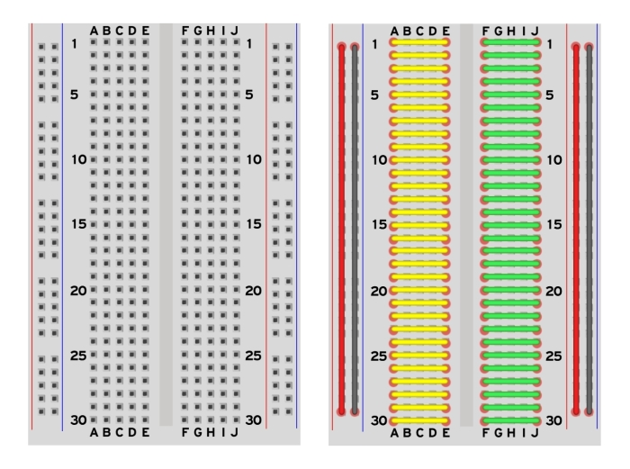
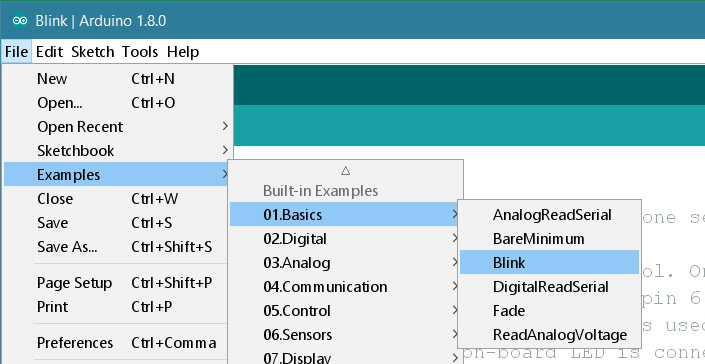

# Tutorial 1 - Arduino UNO

In this workshop we will be introducing you to Arduino, an open-source electronics platform based on easy-to-use hardware and software.
An Arduino board is the connector between each stage of the robotic loop. It connects the sensors to plan and plan to act

It consists of: a physical programmable circuit board (microcontroller)and a software IDE (Integrated Development Environment)


The major components of Arduino UNO board are as follows:

* USB Plug: This is a printer USB port used to load a program from the Arduino IDE onto the Arduino board. The board can also be powered through this port.
* External Power Supply: The Arduino board can be powered through an AC-to-DC adapter or a battery. The power source can be connected by plugging in a 2.1mm center-positive plug into the power jack of the board.

  The Arduino UNO board operates at a voltage of 5 volts, but it can withstand a maximum voltage of 20 volts. If the board is supplied with a higher voltage, there is a voltage regulator (it sits between the power port and USB connector) that protects the board from burning out.
* Microcontroller: Microcontrollers are self contained computers. They contain a processor along with inbuilt peripherals, which are devices that are used to exchange information (input output) with a computer (e.g memory, serial interface, I/O like USB, mouse keyboard etc.).

* Analog input pins: The Arduino UNO board has 6 analog input pins, labeled “Analog 0 to 5.” These pins can read the signal from an analog sensor like a temperature sensor and convert it into a digital value so that thesystem understands. These pins just measure voltage and not the current because they have very high internal resistance. Hence, only a small amount of current flows through these pins.

  Although these pins are labeled analog and are analog input by default, these pins can also be used for digital input or output.

* Digital I/O pins: You can find these pins labeled “Digital 0 to 13.” These pins can be used as either input or output pins. When used as output, these pins act as a power supply source for the components connected to them. When used as input pins, theyread the signals from the component connected to them.

  When digital pins are used as output pins, they supply 40 milliamps of current at 5 volts, which is more than enough to light an LED.

  Some of the digital pins are labeled with tilde (~) symbol next to the pin numbers (pin numbers 3, 5, 6, 9, 10, and 11). These pins act as normal digital pins but can also be used for Pulse-Width Modulation (PWM), which simulates analog output like fading an LED in and out.
* Reset switch: When this switch is clicked, it sends a logical pulse to the reset pin of the Microcontroller, and now runs the program again from the start. This can be very useful if your code doesn’t repeat, but you want to test it multiple times.
* Crystal oscillator: This is a quartz crystal oscillator which ticks 16 million times a second. On each tick, the microcontroller performs one operation, for example, addition, subtraction, etc.
* USB interface chip: Think of this as a signal translator. It converts signals in the USB level to a level that an Arduino UNO board understands.
* TX RX LEDs: TX stands for transmit, and RX for receive. These are indicator LEDs which blink whenever the UNO board is transmitting or receiving data.
* Power Pins: VIN (sometimes labelled "9V"). The input voltage to the Arduino board when it's using an external power source (as opposed to 5 volts from the USB connection or other regulated power source). You can supply voltage through this pin, or, if supplying voltage via the power jack, access it through this pin. Note that different boards accept different input voltages ranges, please see the documentation for your board. Also note that the LilyPad has no VIN pin and accepts only a regulated input.

  5V. The regulated power supply used to power the microcontroller and other components on the board. This can come either from VIN via an on-board regulator, or be supplied by USB or another regulated 5V supply.

  3.3V. (Diecimila-only) A 3.3 volt supply generated by the on-board FTDI chip.
  GND. Ground pins.

## Breadboard

Breadboards are one of the most fundamental pieces when learning how to build circuits.
A breadboard is a solderless construction base used for developing an electronic circuit and wiring for projects with microcontroller boards like Arduino.



Each row is connected as a series connection

Columns are not connected (Parallel)

The redline are Positive terminals and the black line negative

## Arduino IDE

The open-source Arduino Software (IDE) makes it easy to write code and upload it to the board. This software can be used with any Arduino board.

To set up Arduino IDE, download and set up from (https://www.arduino.cc/en/software)

After setting up, open Arduino IDE

* Connect the circuit as shown in the image below


* Open your first sketch
  Open the LED blink example sketch: File > Examples >01.Basics > Blink.



* Select your board type and port
  You'll need to select the entry in the Tools > Board menu that corresponds to your Arduino board.


Select the serial device of the board from the Tools | Serial Port menu. This is likely to be COM3 or higher (COM1 and COM2 are usually reserved for hardware serial ports). To find out, you can disconnect your board and re-open the menu; the entry that disappears should be the Arduino board. Reconnect the board and select that serial port.


* Upload the program

  Now, simply click the "Upload" button in the environment. Wait a few seconds - you should see the RX and TX leds on the board flashing. If the upload is successful, the message "Done uploading." will appear in the status bar.
  

  
  A few seconds after the upload finishes, you should see the pin 13 (L) LED on the board start to blink. If it does, congratulations! You've gotten Arduino up-and-running. 


### Understanding Code

Let's try breaking down the Blink code

The Arduino IDE program contains two main parts: setup () and loop (). The name of the functions implies their purpose and activity: setup () sets up the Arduino hardware, such as specifying which I/O lines is planned to use, and whether they are inputs or outputs. The loop () function is repeated endlessly when the Arduino runs. Arduino IDE (Integrated development environment) is used to write the program and dump into the Arduino board. The program was written and dumped into the Arduino. 

```
// the setup function runs once when you press reset or power the board
void setup() {
  // initialize digital pin LED_BUILTIN as an output.
  pinMode(LED_BUILTIN, OUTPUT);
}

// the loop function runs over and over again forever
void loop() {
  digitalWrite(LED_BUILTIN, HIGH);   // turn the LED on (HIGH is the voltage level)
  delay(1000);                       // wait for a second
  digitalWrite(LED_BUILTIN, LOW);    // turn the LED off by making the voltage LOW
  delay(1000);                       // wait for a second
}
```

* //: is used to comment. Comments do not effect the code, they are just added so that the programmers understands the function of the line or function
* ; the semicolon is used to indicate the end of a line (the code won't work if the lines are missing any)
* The pinMode() function is used to configure a specific pin to behave either as an input or an output.
* LED_BUILTIN is a built in variable that is 13, it can be changed to whatever pin the LED is connected to. But instead of writing 13 in the pinMode() function, it's better practice to create a new constant variable (before void setup()) with the value of the pin (Example: const int LEDPIN = 13;) and use LEDPIN throughout the code.
* The digitalWrite() function is used to write a HIGH or a LOW value to a digital pin. HIGH being voltage on and LOW - voltage off. But before doing that, the pinmode on said pin should be initialized as an OUTPUT.
* The delay() function allows you to pause the execution of your Arduino program for a specified period.

Now try changing the intervals of the blinkning, Changing digital pin position or (for a challenge) add another pin and alternate blinks.

## Line Tracer IR Sensor

A line tracer does exactly as the name suggests, it detects light lines against a dark background or viceversa. The sensor consists of a transmitter and a reciever. The transmitter sends radiation onto the surface, if radiaiton hit a black line/background, it will get absorbed and nothing would be received by the receiver (1 output). If the background is white/light it will get reflected and the sensor would have an output of 0. The sensor has knob that can be adjusted, it increases or decreases the senitivity of the receiver


### Let's test using a line tracer

* Connect the line tracer to a bread board according to the table and picture shown below


* Connect the series pins to the arduino as shown in the table

| Name | Function |
| --- | --- |
| Vcc | 5V |
| Digital Output | pin 3 |
| GND | GND |

* Open Arduino IDE and copy code

```
const int IRinput = 3; // define pin number

void setup() {
  // put your setup code here, to run once:
  pinMode(IRinput,INPUT); // Sets the IR digital input as an Input
  Serial.begin(9600); // Starts the serial communication
}

void loop() {
  // put your main code here, to run repeatedly:
  if (digitalRead(IRinput) == HIGH) // If the input is 1 (Dark background)
  {
    Serial.println("DARK"); // Prints DARK on the Serial Monitor, if Dark/Black background
  }

    else
    {
      Serial.println("LIGHT"); // Prints LIGHT on the Serial Monitor otherwise
      Serial.println(digitalRead(IRinput));
    }
    

  delay(2000); // Wait for 2000 milliseconds (2 sec)

}
```

* Connect the Arduino board to computer
* Upload code
* Open Serial monitor (far right button on the screen)
* Try putting a dark and light background infront of sensor and observe a serial monitor


* For a challenge try adding an LED light to the breadboard and make it light up when there is a dark background

## Ultrasonic sensor

Ultrasonic Sensor HC-SR04 is a sensor that can measure distance. It emits an ultrasound at 40 000 Hz (40kHz) which travels through the air and if there is an object or obstacle on its path It will bounce back to the module. Considering the travel time and the speed of the sound you can calculate the distance.


There are 4 pins to be used

| Name | Function |
| --- | --- |
| Vcc | 5V |
| Trig | Signals the sensor to send a pulse |
| Echo | Output the time in microseconds |
| GND | GND |

Let's try using the Ultrasonic Sensor

* Connect the sensor to the breadboard and connect the series pins to the arduino
Here is a schematic for reference. You don't need to strictly follow this.


| Name | Function |
| --- | --- |
| Vcc | 5V |
| Trig | Pin 10 |
| Echo | Pin 9 |
| GND | GND |

The logic behind the code is to continuously calculate (infinitely) the distance to an object we have to do the following within a loop funtion.

To do that:
* Define pin numbers and variables to store distance and duration/time for the signal to go and return
* Set up tigger pin as an Output
* Set up echo pin as an Input
* Start Serial communication (this transfers the data to the computer to be displayed in serial monitor)

In the Loop (void loop())

* Clear the trigger pin (set it to ground)
* Set the trigger pin high for 10us
* Read the Echo pin for the duration
* Calculate the distance
* Print the distance to the serial monitor.

```
// defines pins numbers
const int trigPin = 10;
const int echoPin = 9;

// defines variables
long duration;
int distance;

void setup() {
    pinMode(trigPin, OUTPUT); // Sets the trigPin as an Output
    pinMode(echoPin, INPUT); // Sets the echoPin as an Input
    Serial.begin(9600); // Starts the serial communication
}

void loop()
{
    // Clears the trigPin
    digitalWrite(trigPin, LOW);
    delayMicroseconds(2);

    // Sets the trigPin on HIGH state for 10 micro seconds
    digitalWrite(trigPin, HIGH);
    delayMicroseconds(10);
    digitalWrite(trigPin, LOW);

    // Reads the echoPin, returns the sound wave travel time in microseconds
    duration = pulseIn(echoPin, HIGH);

    // Calculating the distance
    distance= duration*0.034/2;

    // Prints the distance on the Serial Monitor
    Serial.print("Distance: ");
    Serial.println(distance);
}
```

* Connect the Arduino UNO to the computer
* Upload code
* Open Serial monitor in the right corner of the Arduino IDE
* Move any object close to the sensor and move the object further from the sensor
* Observe how the distance in the serial monitor changes
