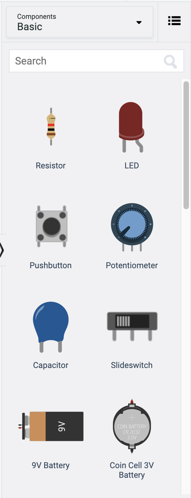

# Using TinkerCad
Now that you have opened TinkerCad it is time for you to learn how to use it.
## Opening your new circuits file
Try looking at the tab on your left-hand side. You will be able to find this tab on the picture below. 
 
On that tab, click "Circuits". Once you click "Circuits", you would see a new function called "Create New Circuit". Clcik on it and let the magic begin!  
 
## Creating your circuit
First of all, it looks overwhelming isn't it? Have a look at your new space. You can see that on the right, you would be able to see all the basic components. 
 
With that, simply just click and drag the components that you need. If you need to find a component, simply search it up, just click on the search bar on the tab. For example, if you wish to insert an Arduino, search up 'Arduino' and drag it as shown in this picture. We have shown you an example circuit on the slides and worksheet that you can refer to for your creation. Happy creating!
## Simulating your circuit
Now look to your top right. You can see this toolbar over here. 
 
You would see a plethora of blocks that you can code from. We would look into text-base coding later. But now, let's go through the block-base coding. If you have used scratch before, this process of coding will seem pretty familiar.
