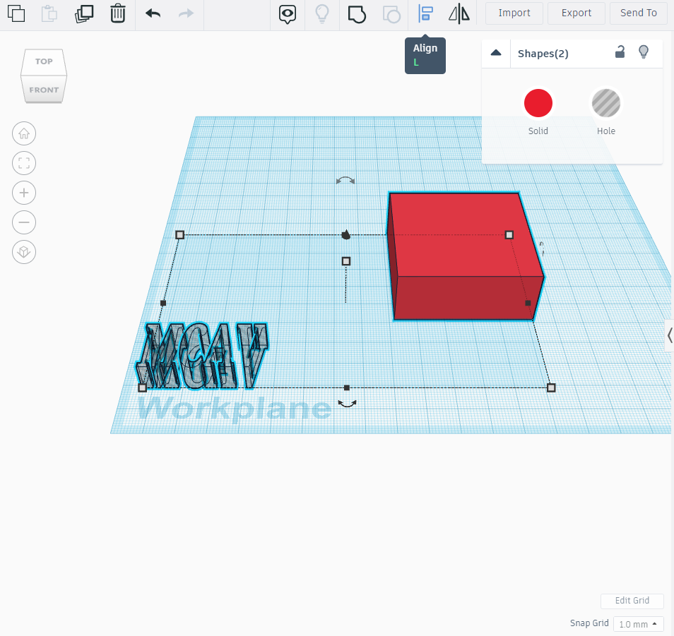

# TINKERCAD

Tinkercad is a free-of-charge, online 3D modeling program that runs in a web browser. Since it became available in 2011 it has become a popular platform for creating models for 3D printing as well as an entry-level introduction to constructive solid geometry in schools.

If you have been wanting to design your own 3D printed object, Tinkercad is a great starting point. Advanced modelers may prefer programs like Fusion 360, SolidWorks, and Blender, but these can have a steep learning curve. If you are looking to design your own 3D printed object in a modeling software, Tinkercad can get you there in no time.
The basics of Tinkercad are simple: you drag a shape onto the workplane, modify it, and combine it with other shapes.

Go to (https://www.tinkercad.com/) and sign up

## Tutorial 1
Once you've logged in, make sure 3D Designs is selected on the left and click Create new design.

Once you open a workspace, right-click and drag on the workplane, it will rotate. If you middle-click and drag on the workplane, it will pan. Try playing around with rotating and panning your workplane to get a feel for how it works.

Let's laydown a foundation. Click the red box then click on any position in the workspace to drop it.

To change the dimensions, click on any of the small boxes on the edge of the cube like shown in the image below.

You can also change the type of cube to be a hole instead of a solid like shown in the image below.

Add another cube and change the dimensions as seen in the image.

Select both shapes (Shift + click on both shapes) and click align (highlighted blue) or press L on the keyboard

Align both shapes as seen below and click on group (highlighted blue) or ctrl + g

After getting the hollow cube, click on the cube, hover over the top of the cube and click the 2 directional arrows on the top

Change the angle to 45 degrees. You can change the angle of the body in any direction.

The Final shape should be as seen below.

## Tutorial 2

Add a cube and change the dimensions as seen below

Scroll down on basic shapes, find and click on the text icon

Place the text on the workspace and change the text to any word

Change the dimensions as shown below.

Change the text to hole and align both shapes as shown below

Group both shapes and now you have a block with your word. :)

## Tutorial 3

Now let's make a part for the project
Make a workspace and edit the workplane

Add 2 boxes and change the dimensions to 
Box 1 (Solid): 200 X 150 X 60
Box 2 (Hole): 180 X 150 X 50

Align and group both boxes as shown below

It should look like this

Add another 2 boxes 
Box 1 (Solid): 10 X 10 X 50
Box 2 (Hole): 6 X 6 X 50

Align and group both boxes as shown

Copy and paste (ctrl + C, ctrl + V) the small figure 4 times

Change the 4 figures into holes

Align and group one of the small figures with the big figure as shown. Do the same for the other side.

Rotate 2 of the small figures 180 degrees.

Align and group the opposite figures to the opposite side of the big figure.

Rotate the new figure as shown.

Add a text (Hole) with the your Team's name

Align and group the text with the figure and Voilà you got your car cover!!!

